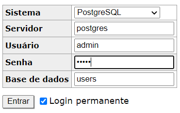
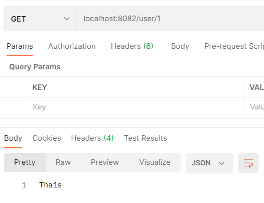
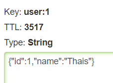
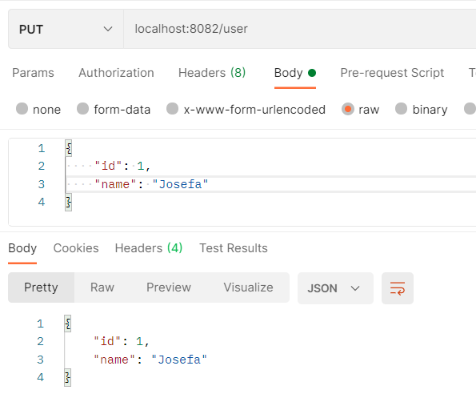

# MicronautCacheRedis

This project implements a cache system using Redis, and it's structured using clean architecture pattern.

## How to test

* Run git bash at project root and run the command: docker-compose up -d
* Then all necessary images will be up at docker
* Now open the project, access gradle tasks and run clean build
* Run the project
* At browser, access http://localhost:8081/ to see the visual interface for redis
* And access the database using the following information:

* Now, access the users table and add some new user
* Finally, import the collection at postman and make a request to get the user you just added

* At this point, if you access redis commander you'll se the key and value stored

* Now you can add more users to make the next test
* Make a request to update some user

* Visit redis and see that this key was excluded, and the update was made at postgres

* Another verification that can be made is that when the key is already at redis, a "select" is not done by hibernate at application logs when we make a request to get user information

